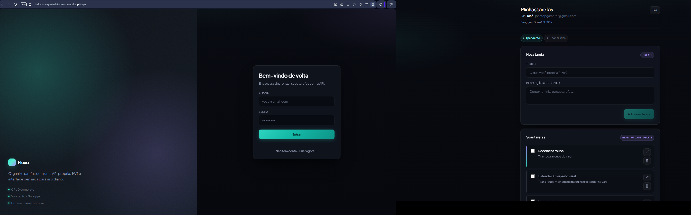

# Fluxo — Gerenciador de Tarefas

Aplicação fullstack de gerenciamento de tarefas com autenticação, chat em tempo real e API documentada. Desenvolvida para praticar o fluxo completo de uma aplicação web moderna: do banco de dados à interface.

**[Acessar o projeto online →](https://task-manager-fullstack-nu.vercel.app)**



---

## Funcionalidades

- Cadastro e login com autenticação JWT
- Criação, edição e exclusão de tarefas
- Marcar tarefas como concluídas
- Chat em tempo real entre usuários autenticados (WebSocket)
- API documentada com Swagger
- Interface responsiva com dark mode

---

## Tecnologias utilizadas

**Frontend**
- React + Vite
- CSS puro (responsivo)

**Backend**
- Node.js + Express
- JWT para autenticação
- Zod para validação de dados
- Socket.IO para comunicação em tempo real
- SQLite (desenvolvimento) — estrutura preparada para PostgreSQL em produção
- Swagger para documentação da API

**Deploy**
- Frontend: Vercel
- Backend: Render

---

## Como rodar localmente

```bash
# Clone o repositório
git clone https://github.com/JosAug/task-manager-fullstack.git
cd task-manager-fullstack

# Instale as dependências
npm install
npm install --prefix server
npm install --prefix client

# Configure as variáveis de ambiente
copy server\.env.example server\.env   # Windows
# cp server/.env.example server/.env   # Mac/Linux

# Suba frontend e backend juntos
npm run dev
```

- Frontend: http://localhost:5173  
- API: http://localhost:4000  
- Swagger: http://localhost:4000/api/docs

---

## O que aprendi

Este projeto foi meu primeiro contato prático com o fluxo completo de uma aplicação web:

- Como funciona autenticação com JWT (geração e validação de tokens)
- Como estruturar uma API REST com Express
- Como conectar frontend e backend via HTTP e WebSocket
- Como fazer deploy de aplicações separadas (frontend estático + API Node)
- Por que SQLite é conveniente em desenvolvimento mas PostgreSQL é o padrão em produção

---

## Autor

**José Augusto**  
Estudante de Análise e Desenvolvimento de Sistemas  
[GitHub](https://github.com/JosAug)
